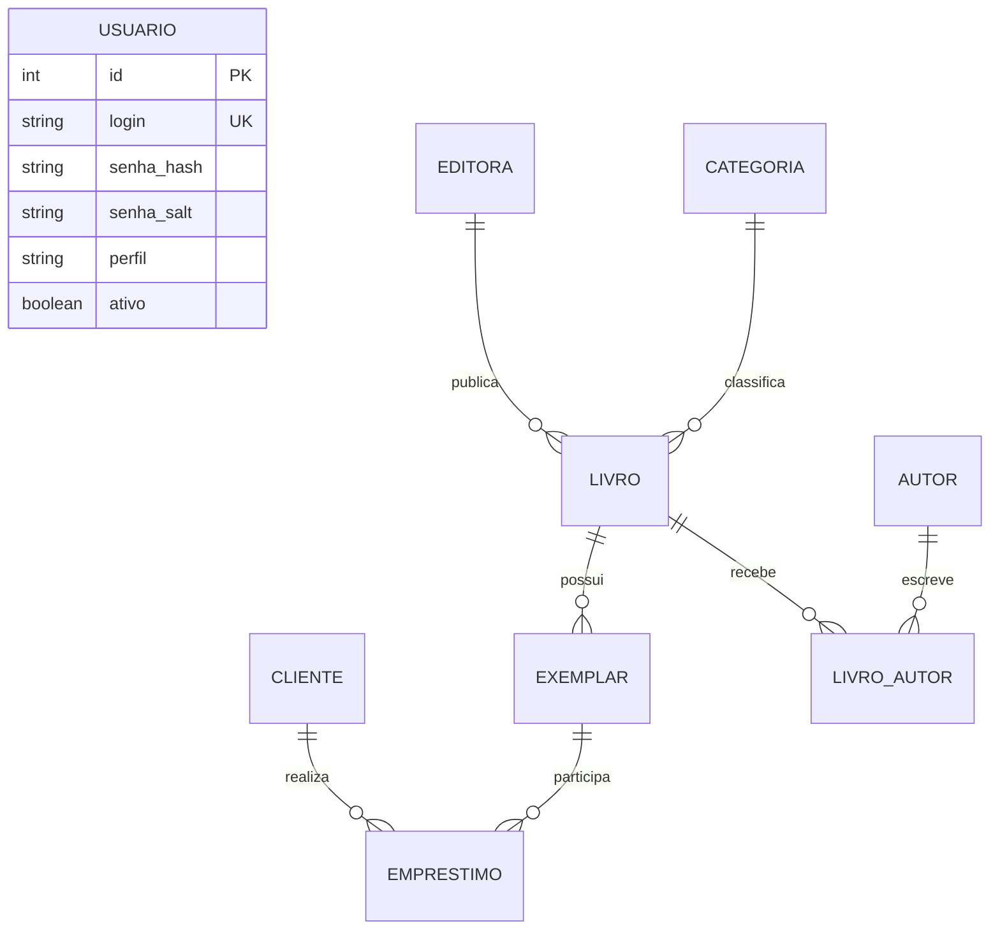

# Modelo de dados

## Diagrama entidade-relacionamento

## Leitura dos relacionamentos

| Origem | Cardinalidade | Destino | Significado |
|---|---:|---|---|
| Editora | 1:N | Livro | uma editora publica varios livros |
| Categoria | 1:N | Livro | uma categoria classifica varios livros |
| Livro | N:N | Autor | resolvido pela tabela `livro_autor` |
| Livro | 1:N | Exemplar | a obra pode ter varias unidades fisicas |
| Cliente | 1:N | Emprestimo | o leitor pode realizar varias retiradas |
| Exemplar | 1:N historico | Emprestimo | a unidade participa de varios emprestimos ao longo do tempo |

O sistema impede mais de um emprestimo aberto para o mesmo exemplar por bloqueio `FOR UPDATE` dentro da transacao.

## Chaves e integridade

- `livro_autor` usa chave primaria composta `(id_livro, id_autor)`.
- as FKs principais usam `ON DELETE RESTRICT` para impedir perda de historico;
- a relacao de autores de um livro usa `ON DELETE CASCADE` apenas quando o proprio livro e removido;
- login, CPF, ISBN e codigo do exemplar possuem indices unicos;
- tabelas e relacionamentos usam InnoDB para suportar transacoes.

## Livro e exemplar

`Livro` representa a obra bibliografica: titulo, ISBN, ano, editora, categoria e autores. `Exemplar` representa uma unidade fisica identificada por um codigo. Assim, um unico livro pode ter `EX0001`, `EX0002` e `EX0003`.
